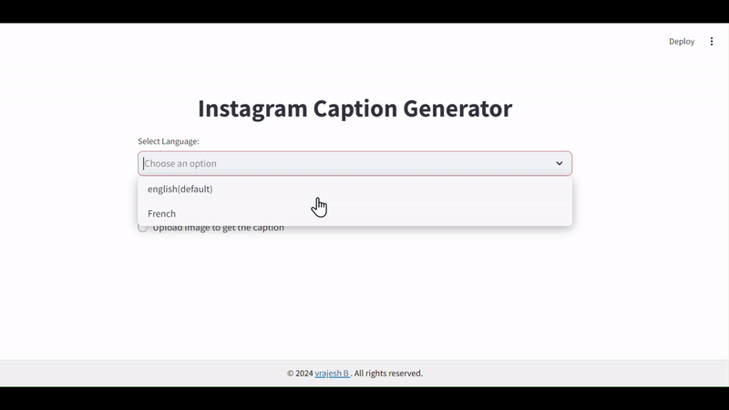

# InstaCaptionAI

InstaCaptionAI is a Streamlit-based web application that uses Google's Generative AI models to create engaging Instagram captions based on user-provided scenarios or images. This tool is designed to help users generate creative, humorous, and conversational captions tailored to their specific needs.

## Features

- **Text-Based Captions**: Generate captions by explaining the scenario in text.
- **Image-Based Captions**: Upload an image and generate captions based on it.
- **Language Support**: Supports multiple languages, including English and French.
- **Customizable Tones**: Choose from various tones such as Creative, Humorous, Funny, and more.
- **Responsive UI**: User-friendly interface with real-time caption generation.

## Installation

### Prerequisites

- Python 3.7 or higher
- Streamlit and other necessary libraries (listed in `requirements.txt`)

### Setup

1. **Clone the Repository:**

   ```bash
   git clone https://github.com/Vrajeshbrahmbhatt06/InstaCaptionAI
   cd InstaCaptionAI
   ```

2. **Install the Required Packages:**

   ```bash
   pip install -r requirements.txt
   ```

3. **Set Up Environment Variables:**

   - To run the app locally, add your Google API key to a `.env` file:

     ```env
     GOOGLE_API_KEY='your_api_key'
     ```

   - If you are deploying the app, store the API key in `secrets.toml`:

     ```toml
     GOOGLE_API_KEY = 'your_api_key'
     ```

4. **Running the App Locally:**

   - If running locally, comment out the line that retrieves the API key from `st.secrets` and uncomment the code that loads the key from the `.env` file.

   - Start the Streamlit app:

     ```bash
     streamlit run caption_ai.py
     ```

## Usage

1. **Select Language:**
   - Choose the language for the captions (e.g., English, French).

2. **Choose Input Method:**
   - You can either explain the scenario using text or upload an image.

3. **Generate Captions:**
   - Select the number of alternative captions, tone, and caption type.
   - Click on "Generate Caption" to see the results.

4. **Clear Output:**
   - Clear the generated captions using the "Clear Output" button to generate new captions.

## Project Demo

### Text-Based Caption Generation
Here’s a short demo of generating captions using text input:



### Image-Based Caption Generation
Here’s a short demo of generating captions using an image:


## Code Structure

- `caption_ai.py`: The main Streamlit application file.
- `requirements.txt`: List of dependencies required to run the application.

## Contributing

Contributions are welcome! Please open an issue or submit a pull request if you have suggestions for improvements or find bugs.

## License

This project is licensed under the MIT License. See the [LICENSE](LICENSE) file for more details.
